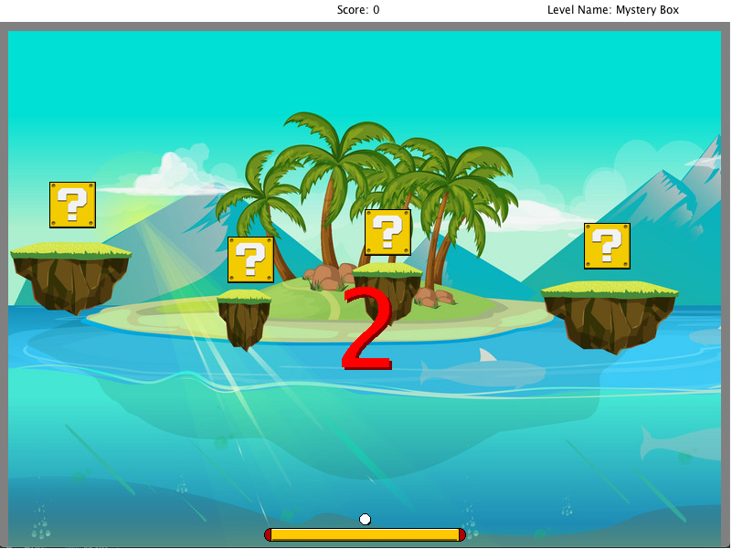
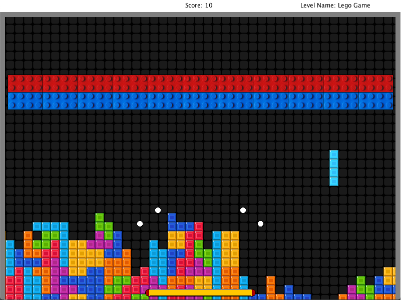
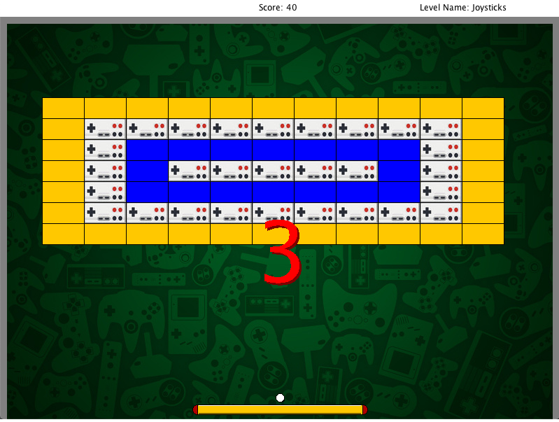
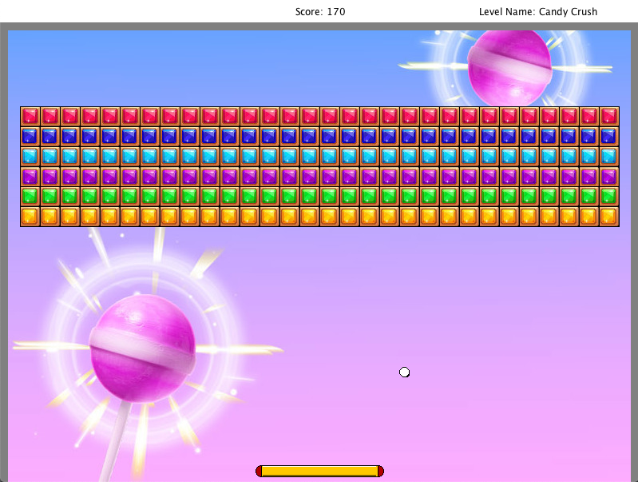

# Arkanoid

Welcome to this **ARKANOID** game.

This is a special arkanoid game:
In order to add levels to the game, you don't have to learn to code! Inside the Arkanoid/resources/definitions you will find simple txt files. 
The level_definition.txt file defines each level in the game. Here, you can change the level by simply editing this text file. 
Withot coding, you can change anything from the name of the level, the images, the number of balls, the velocities, the blocks, etc. 

In addition, each level has its own file in which you can further personalize the blocks desing of each level separately. 

The game is made in a way that is able to read the txt file, and change the code according to that!

These are some levels I created from the txt files:

## Level 1:

## Level 2:

## Level 3:

## Level 4:

Feel free to download this or edit from here the levels files, and play around with it, have fun! 
